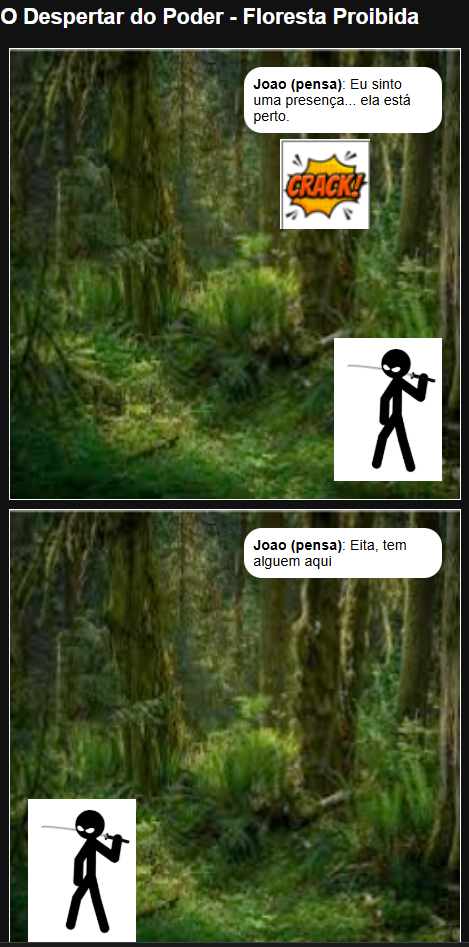

# Template da Entrega Parcial 2


# DSL `DSL Criação de Quadrinhos`

## Descrição Resumida da DSL

### Contextualização da linguagem:

DSL usada para criação de historia em quadrinhos de maneira automatizada.

### Motivação:

Elementos visuais e narrativos são ótimos para ser descritos em linguagem natural mas não para linguagem de máquina.

### Relevância:

A partir dessa linguagem seria possível fazer a criação de layouts de quadrinhos de maneira automatizada, integração com outras tecnologias assim como possivel narrativa
nterativa.

## Slides

> [Link para Slides Segunda Etapa.](https://docs.google.com/presentation/d/1zfl2GK9UY8qGVcUfvIgOUBY7GwwbGwdAbAwbD9l2eHE/edit?slide=id.g3d8c0a168d2_0_99#slide=id.g3d8c0a168d2_0_99)

## Sintaxe da Linguagem na Forma de Tutorial

O projeto idealiza uma linguagem minimalista e legível para humanos voltada à criação de quadrinhos. Através de uma estrutura organizada em blocos de configuração, definição de assets e fluxo de cenas, a linguagem permite traduzir roteiros literários diretamente em estruturas de dados visuais, suportando estados emocionais, tipos de balões e efeitos sonoros nativamente.

Configuração da página: 
```
# OBRIGATORIO: CENA com parametro "Local"
CENA "nome da cena" (Local: "nome_do_local"):

  # OBRIGATORIO: QUADRO com parametro "Layout" 
  QUADRO numero (Layout: "nome_do_layout"):

    # OBRIGATORIO: CENARIO
    CENARIO: "nome_do_cenario"
  
    # OPCIONAL: RECORDATORIO
    RECORDATORIO: "texto do recordatorio."
  
    #  OPCIONAL: linha com nome do personagem especificando sua "Posicao" e "Sentimento"
    NOME_DO_PERSONAGEM (Posicao: "posição", Sentimento: "sentimento")
  
    #  OPCIONAL: linha com nome de personagem especificando sua "açao". Ação pode ser "diz", "grita", "pensa" ou "sussurra" sem aspas.
    NOME_DO_PERSONAGEM acao: "dialogo"
      
    # OPCIONAL: Efeito
    EFEITO: "nome do efeito"

# palavras-chave da linguagem: CENA, Local, QUADRO, Layout, CENARIO, RECORDATORIO, Posicao, Sentimento, diz, grita, pensa, sussurra e EFEITO

ASSETS:
  # O source aponta para a pasta; o interpretador buscará o PNG lá dentro
  PERSONAGEM Joao (Source: "assets/characters/joao/", Formato: ".png")
  PERSONAGEM Maria (Source: "assets/characters/maria/", Formato: ".png")
  CENARIO Quarto (Source: "assets/backgrounds/quarto_noite.jpg")
```

## Gramática da Linguagem

```
S → ROTEIRO

ROTEIRO → CENA ROTEIRO
ROTEIRO → CENA

CENA → "CENA" STRING PARAMS_CENA ":" QUADROS

PARAMS_CENA → "(" "Local" ":" STRING ")"

QUADROS → QUADRO QUADROS
QUADROS → QUADRO

QUADRO → "QUADRO" NUMERO PARAMS_QUADRO ":" CENARIO ELEMENTOS

PARAMS_QUADRO → "(" "Layout" ":" STRING ")"

CENARIO → "CENARIO" ":" STRING

ELEMENTOS → ELEMENTO ELEMENTOS
ELEMENTOS → ε   // 0 ou mais elementos

ELEMENTO → RECORDATORIO
ELEMENTO → ENTRADA
ELEMENTO → FALA
ELEMENTO → EFEITO

RECORDATORIO → "RECORDATORIO" ":" STRING

ENTRADA → IDENT PARAMS_ENTRADA

PARAMS_ENTRADA → "(" PARAM_LISTA ")"

PARAM_LISTA → PARAM_ENTRADA "," PARAM_LISTA
PARAM_LISTA → PARAM_ENTRADA

PARAM_ENTRADA → "Posicao" ":" STRING
PARAM_ENTRADA → "Sentimento" ":" STRING

FALA → IDENT ACAO ":" STRING

ACAO → "diz"
ACAO → "grita"
ACAO → "pensa"
ACAO → "sussurra"

EFEITO → "EFEITO" ":" STRING
```

## Notebook

Implementação feita em javascript na pasta src do projeto.

## Exemplos Selecionados

```
CENA "O Despertar do Poder" (Local: "Floresta Proibida"):

QUADRO 1 (Layout: "Topo_Largo"):
CENARIO: "Floresta"

# O interpretador busca em: assets/characters/joao/em_guarda.png
Joao (Posicao: "Direita", Sentimento: "Em guarda")

Joao pensa: "Eu sinto uma presença... ela está perto."
EFEITO: "CRACK!"
RECORDATORIO: "O silêncio da floresta é interrompido."

CENA "" (Local: "Floresta Proibida"):

QUADRO 1 (Layout: "Topo_Largo"):
CENARIO: "Floresta"

# O interpretador busca em: assets/characters/joao/em_guarda.png
Joao (Posicao: "Esquerda", Sentimento: "Em guarda")

Joao pensa: "Eita, tem alguem aqui"
RECORDATORIO: "O silêncio da floresta é interrompido."
```



## Discussão

Linguagens como Javascript e Python lendo os comandos linha a linha podem facilmente separar o entendimento e executar funções diferentes para comandos diferentes.

Javascript lida muito bem com HTML nativamente e facilita implementação.

A linguagem foi pensada para buscar imagens no diretório, um background interessante fora do visual do usuário.

## Conclusão

A implementação se mostrou mais realista do que imaginávamos, mas alguns desafios foram mostrados como:

- Posicionamento Flexível
- Posicionamento Inteligente
- Múltimos balões de fala ou pensamento
- Múltiplos efeitos

# Trabalhos Futuros

Projeto tem total potencial para esturuturar quadrinhos mais inteligentes.

Inicialmente toda a implementação foi feita em um arquivo só como MVP, mas é possível estruturar um projeto de compilador bem mais sofisticado.

# Referências Bibliográficas
